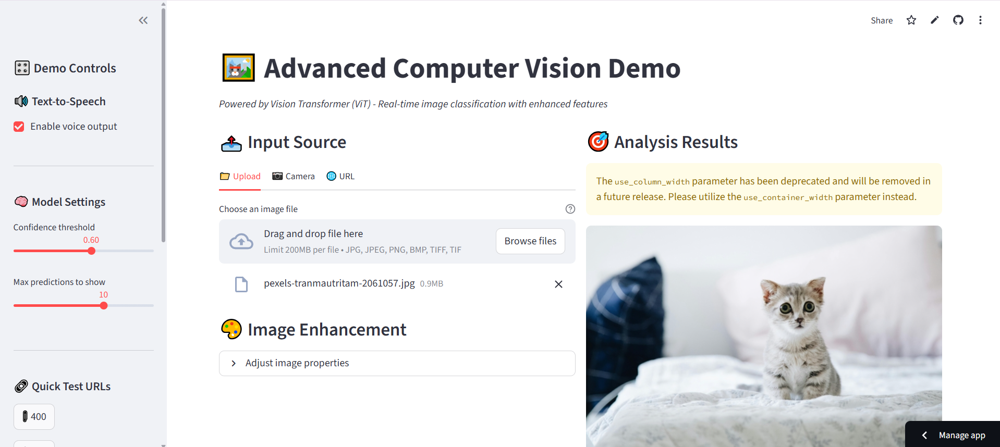
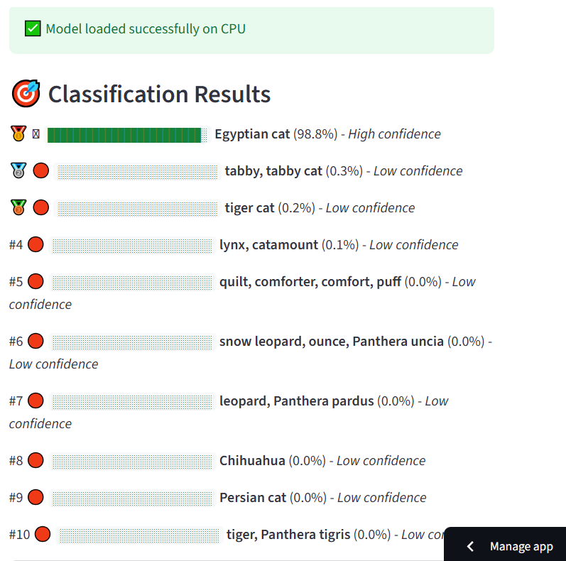

# 🎯 ClassifyX – AI Image Classifier

Mainly detect the **Birds** and **Animals** in the road or road side area to protect the animals , birds as well as human from accidents 

ClassifyX is a **Streamlit-based AI web app** that classifies uploaded images into different categories using a deep learning model.  
It provides an **easy-to-use interface** with real-time predictions and speech output for accessibility.

---

## 🚀 Demo

👉 [Click here to run the app](https://classifyx.streamlit.app/)  

<p align="center">
  
</p>
<p align="center">
  
</p>
---

## 📦 Installation

Clone this repository and install dependencies:

```bash
git clone https://github.com/your-username/Advanced-CV-Demo.git
cd Advanced-CV-Demo
pip install -r requirements.txt


## 🚀 Features
- 📂 Upload an image and get instant predictions  
- 🧠 Uses a pre-trained AI model for classification  
- 🔊 Text-to-Speech (TTS) support for reading predictions aloud  
- 🌐 Runs directly in your browser with Streamlit  

---

## 🖼️ Screenshot


---

## 🛠️ Installation

Clone this repository and install dependencies:

```bash
git clone https://github.com/your-username/classifyx.git
cd classifyx
pip install -r requirements.txt
